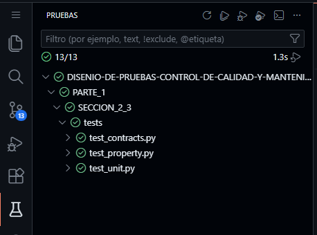

# Parte 1
En la Sección 1 (carpeta llamada `SECCION_1`) se implementa un mini-framework híbrido construido encima de Jasmine (sin reemplazarlo) para probar un algoritmo de búsqueda binaria y cumplir con:

- Pruebas de integración con GitHub Actions (CI): ejecución automática de pruebas en cada push/PR.
- Mocking con espías personalizados: se usa un helper (createSpy) para interceptar dependencias, registrar llamadas y restaurarlas.
- Generación automática de pruebas basada en tipos: creación dinámica de pruebas a partir de tablas de casos (valores inválidos) sin escribir cada it(...) manualmente.


Por otro lado, las Secciones 2 y 3 están unificadas en la carpeta `SECCION_2_3`, donde se reimplementa el mismo algoritmo en Python y se realiza el trabajo de calidad de pruebas.
- Por un lado se ejecutan pruebas con pytest (incluyendo contratos con icontract y pruebas basadas en propiedades con hypothesis, integrables desde la vista Testing de VS Code).
- Además, se utilizan herramientas de evaluación de métricas como mutmut (mutación), radon (complejidad), medición de tiempos, detección de flaky tests y el análisis de la relación entre cobertura y defectos.

A continuación, **se detallan los comandos necesarios para ejecutar cada una de las secciones de la primera parte.**

## Sección 1: Ejecución del proyecto con Jasmine
Este comando entra a la carpeta de la Sección 1, instala las dependencias desde el lockfile (npm ci) y ejecuta la suite de pruebas con Jasmine (npm test).

```bash
(cd "PARTE_1/SECCION_1" && npm ci && npm test)
```

## Sección 2: Testing 
**En la segunda sección, para verificar que los tests funcionan se debe utilizar la interfaz gráfica de Pruebas (Testing) integrada en Visual Studio Code.**

Para el testing de mutación se utiliza mutmut. Ejecuta el siguiente comando en tu terminal:

```bash
(cd "PARTE_1/SECCION_2_3" && mutmut run)
```

## Sección 3 (Métricas de calidad)
Este comando corresponde a la sección 3 y ejecuta todas las métricas solicitadas (complejidad, timings, flaky y cobertura vs defectos):

```bash
(python PARTE_1/SECCION_2_3/metricas/run_all.py)
```

<br>


# Herramientas Utilizadas

## SECCIÓN 1:

**Lenguajes y Entornos:**
- JavaScript
- Node.js

**Frameworks de Pruebas:**
- Jasmine

**Gestores de Paquetes:**
- npm

## SECCIÓN 2 y 3:

**Lenguaje:**
- Python

**Frameworks de Pruebas:**
- pytest

**Librerías de Testing:**
- icontract (contratos de diseño con pre/postcondiciones)
- hypothesis (pruebas basadas en propiedades con generación automática de casos)

**Herramientas de Análisis y Métricas:**
- radon (análisis de complejidad ciclomática)
- mutmut (testing de mutación)
- pytest-cov (medición de cobertura de código)


<br>

# Estructura del Proyecto

## Sección 1

- `package.json`:
Archivo de configuración de Node.js que establece: 
    - Nombre del proyecto: mini-framework-hibrido-jasmine 
    - Punto de entrada principal: src/busquedaBinaria.js 
    - Script de pruebas: npm test ejecuta Jasmine 
    - Dependencia de desarrollo: Jasmine v5.0.0

- `package-lock.json`:
Archivo que registra las versiones exactas de todas las dependencias instaladas (incluyendo subdependencias) para garantizar que las instalaciones sean idénticas y consistentes en diferentes entornos o máquinas.

### Archivos dentro de src/

- `busquedaBinaria.js`:
Contiene el **algoritmo principal** (busquedaBinaria). Incluye validaciones de entradas y usa dependencias “mockeables” para verificar el orden ascendente del arreglo y registrar el valor de medio durante la ejecución.

- `dependencias.js`:
Agrupa dependencias auxiliares separadas del algoritmo para poder **aislar y simular comportamientos** en pruebas:
    - `estaOrdenadoAscendente(arreglo)`: valida el orden ascendente.
    - `registrador(mensaje)`: registro simple usado como punto de observación (ideal para espías).


### Archivos dentro de spec/

- `busquedaBinaria.spec.js`:
Pruebas “clásicas” y de integración con el mini-framework:
    - valida casos funcionales (encuentra / no encuentra / arreglo vacío),
    - prueba **mocking** forzando condiciones (ej. “arreglo no ordenado”),
    - verifica llamadas a dependencias usando el espía personalizado.

- `autoTipos.spec.js`:
Pruebas basadas en tipos con **generación automática**:
    - se crean tablas con entradas inválidas (arreglo inválido, objetivo inválido, elementos inválidos),
    - usa `forEach(...)` para **generar múltiples `it(...)` dinámicamente** a partir de esas tablas.

- `helpers/espiaPersonalizado.js`:
Implementa el componente principal del “mini-framework”: `createSpy`.
Permite:
    - interceptar un método,
    - registrar llamadas y argumentos (`calls`),
    - consultar cantidad/última llamada (`count`, `lastCall`),
    - restaurar el método original (`restore`).

- `support/jasmine.json`:
Se define qué specs cargar, helpers y ejecución aleatoria para detectar dependencias ocultas entre pruebas.

### Automatización

- `.github/workflows/ci.yml`:
**En la raiz del repositorio**, se encuentra el Workflow de **GitHub Actions** que ejecuta el pipeline de pruebas del proyecto (instalación de dependencias + `npm test`) apuntando a la carpeta donde vive esta sección.


## Sección 2 y 3

- `busqueda_binaria.py`:
Implementación de `busqueda_binaria` con contratos usando `icontract`:
    - Función auxiliar para verificar orden no decreciente
    - Precondición: lista ordenada
    - Postcondición: índice válido o -1 si no encontrado
    - Búsqueda binaria clásica

- `setup.cfg`:
Configuración para `mutmut` (testing de mutación): especifica archivo a mutar, comando de pruebas y directorio de tests.

### Archivos dentro de mutants/

Carpeta generada por mutmut en donde se almacenan metadatos importantes para su correcta ejecución.

### Archivos dentro de tests/

- **`test_contracts.py`**: Pruebas de contratos con `icontract` (errores en listas desordenadas, manejo de duplicados)
- **`test_property.py`**: Pruebas basadas en propiedades con `hypothesis` (propiedades de índices y listas sin duplicados)
- **`test_unit.py`**: Pruebas unitarias parametrizadas (casos estándar, fallos, límites)
- **`conftest.py`**: Archivo el cual sirve para que la sección "Pruebas" de VSCode reconozca los test.

### Archivos dentro de metricas/

- **`cobertura_vs_defectos.py`**: Ejecuta cobertura con `pytest-cov` y `mutmut`, calcula métricas de cobertura vs mutantes no matados, guarda en `reports/coverage_vs_defects.txt`
- **`complejidad.py`**: Calcula complejidad ciclomática de tests con `radon`, genera `reports/complexity_by_test.json`
- **`flaky.py`**: Ejecuta pytest 10 veces para detectar pruebas inestables, genera `reports/flaky_report.json` y `reports/pytest_run_x.json`
- **`run_all.py`**: Orquestador que ejecuta todas las métricas en secuencia
- **`timings.py`**: Mide tiempos de ejecución de pruebas, genera `reports/timings_by_test.json`

### Archivos dentro de reports/
Archivos JSON y TXT con resultados de métricas:
- `complexity_by_test.json`, `coverage_vs_defects.txt`, `flaky_report.json`, `pytest_report.json`, `timings_by_test.json`, y corridas individuales `pytest_run_1.json` a `pytest_run_10.json`

# Salidas esperadas de los comandos utilizados

## Seccion 1

```bash
@BrandoMatute24 ➜ /workspaces/DISENIO-DE-PRUEBAS-CONTROL-DE-CALIDAD-Y-MANTENIMIENTO-1-SIN-6A (Evaluacion-en-Contacto-con-el-Docente) $ (cd "PARTE_1/SECCION_1" && npm ci && npm test)

added 43 packages, and audited 44 packages in 884ms

13 packages are looking for funding
  run `npm fund` for details

found 0 vulnerabilities

> mini-framework-hibrido-jasmine@1.0.0 test
> jasmine

Randomized with seed 44151
Started
................


16 specs, 0 failures
Finished in 0.031 seconds
Randomized with seed 44151 (jasmine --random=true --seed=44151)
```

## Seccion 2

```bash
@BrandoMatute24 ➜ /workspaces/DISENIO-DE-PRUEBAS-CONTROL-DE-CALIDAD-Y-MANTENIMIENTO-1-SIN-6A (Evaluacion-en-Contacto-con-el-Docente) $ (cd "PARTE_1/SECCION_2_3" && mutmut run)
⠇ Generating mutants
    done in 71ms
⠦ Listing all tests 
⠼ Running clean tests
    done
⠋ Running forced fail test
    done
Running mutation testing
⠇ 7/7  🎉 7 🫥 0  ⏰ 0  🤔 0  🙁 0  🔇 0
19.25 mutations/second
```
---
Además, se deben ejecutar los tests dentro de la sección Pruebas de VScode en CodeSpaces.




## Seccion 3

```bash
@BrandoMatute24 ➜ /workspaces/DISENIO-DE-PRUEBAS-CONTROL-DE-CALIDAD-Y-MANTENIMIENTO-1-SIN-6A (Evaluacion-en-Contacto-con-el-Docente) $ (python PARTE_1/SECCION_2_3/metricas/run_all.py)

======================================================================
1) Complejidad ciclomática por prueba
======================================================================
Top CC (más complejos):
 5  tests/test_property.py::test_propiedad_indice_valido_o_menos_uno
 4  tests/test_property.py::test_propiedad_con_lista_sin_duplicados
 3  tests/test_contracts.py::test_contrato_pasa_con_lista_ordenada
 2  tests/test_contracts.py::test_contrato_acepta_lista_ordenada_con_duplicados
 2  tests/test_unit.py::test_busqueda_binaria
 1  tests/test_contracts.py::test_contrato_falla_si_lista_no_esta_ordenada
 1  tests/test_contracts.py::test_contrato_detecta_desorden_en_el_ultimo_par

======================================================================
2) Análisis de tiempo de ejecución
======================================================================
.............                                                                                                                                                                                        [100%]
13 passed in 0.71s
Top 10 más lentos:
0.19922560s  PARTE_1/SECCION_2_3/tests/test_property.py::test_propiedad_indice_valido_o_menos_uno  (passed)
0.16854411s  PARTE_1/SECCION_2_3/tests/test_property.py::test_propiedad_con_lista_sin_duplicados  (passed)
0.00242753s  PARTE_1/SECCION_2_3/tests/test_contracts.py::test_contrato_falla_si_lista_no_esta_ordenada  (passed)
0.00134047s  PARTE_1/SECCION_2_3/tests/test_contracts.py::test_contrato_detecta_desorden_en_el_ultimo_par  (passed)
0.00104952s  PARTE_1/SECCION_2_3/tests/test_unit.py::test_busqueda_binaria[lista2-9-4]  (passed)
0.00100650s  PARTE_1/SECCION_2_3/tests/test_unit.py::test_busqueda_binaria[lista0-5-2]  (passed)
0.00095598s  PARTE_1/SECCION_2_3/tests/test_unit.py::test_busqueda_binaria[lista4-3--1]  (passed)
0.00087582s  PARTE_1/SECCION_2_3/tests/test_unit.py::test_busqueda_binaria[lista1-1-0]  (passed)
0.00082368s  PARTE_1/SECCION_2_3/tests/test_unit.py::test_busqueda_binaria[lista3-4--1]  (passed)
0.00081866s  PARTE_1/SECCION_2_3/tests/test_unit.py::test_busqueda_binaria[lista5-10-0]  (passed)

======================================================================
3) Detección de pruebas inestables (flaky tests)
======================================================================
.............                                                                                                                                                                                        [100%]
13 passed in 0.47s
.............                                                                                                                                                                                        [100%]
13 passed in 0.46s
.............                                                                                                                                                                                        [100%]
13 passed in 0.49s
.............                                                                                                                                                                                        [100%]
13 passed in 0.46s
.............                                                                                                                                                                                        [100%]
13 passed in 0.47s
.............                                                                                                                                                                                        [100%]
13 passed in 0.42s
.............                                                                                                                                                                                        [100%]
13 passed in 0.50s
.............                                                                                                                                                                                        [100%]
13 passed in 0.47s
.............                                                                                                                                                                                        [100%]
13 passed in 0.45s
.............                                                                                                                                                                                        [100%]
13 passed in 0.50s
No flaky tests detectados en 10 corridas.

======================================================================
4) Cobertura vs defectos detectados
======================================================================
.............                                                                                                                                                                                        [100%]
============================================================================================== tests coverage ==============================================================================================
_____________________________________________________________________________ coverage: platform linux, python 3.11.14-final-0 _____________________________________________________________________________

Name                  Stmts   Miss  Cover   Missing
---------------------------------------------------
busqueda_binaria.py      16      0   100%
---------------------------------------------------
TOTAL                    16      0   100%
Coverage XML written to file reports/coverage.xml
13 passed in 0.80s
⠇ Generating mutants
    done in 65ms
⠦ Listing all tests 
⠼ Running clean tests
    done
⠋ Running forced fail test
    done
Running mutation testing
⠇ 7/7  🎉 7 🫥 0  ⏰ 0  🤔 0  🙁 0  🔇 0
20.70 mutations/second
Cobertura (line-rate): 100.00%
Mutantes NO matados (survived/timeout/etc.): 0

✔ Listo. Revisa la carpeta reports/
```
