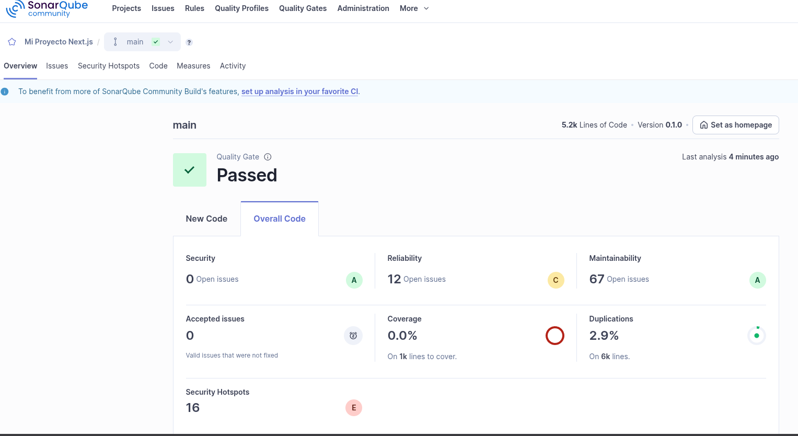
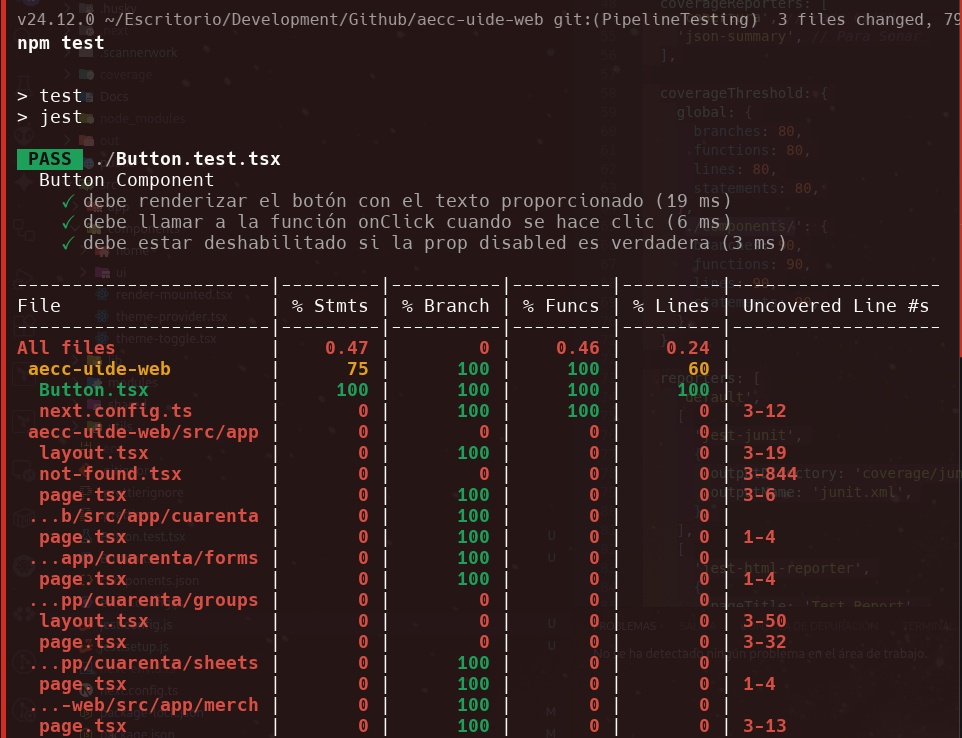
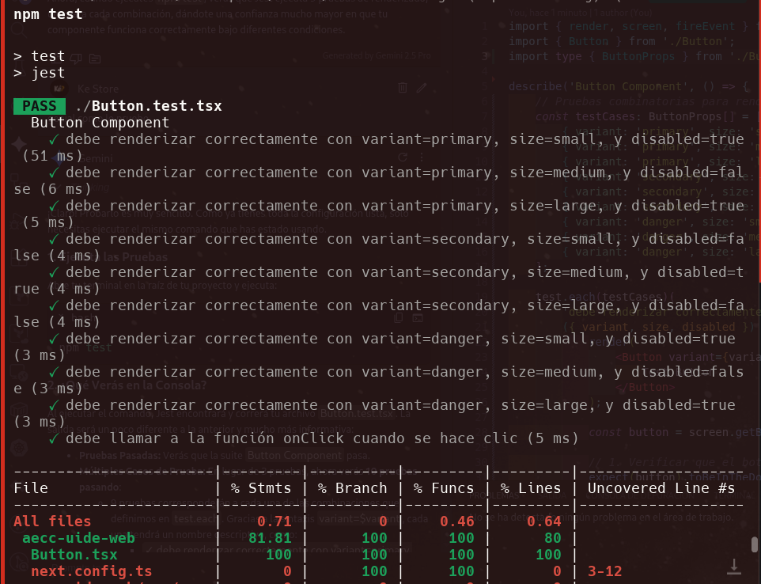
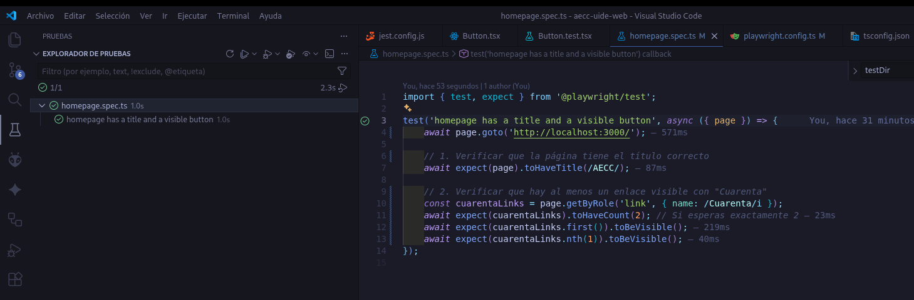
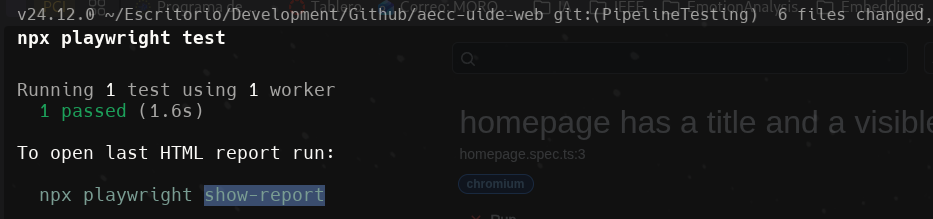
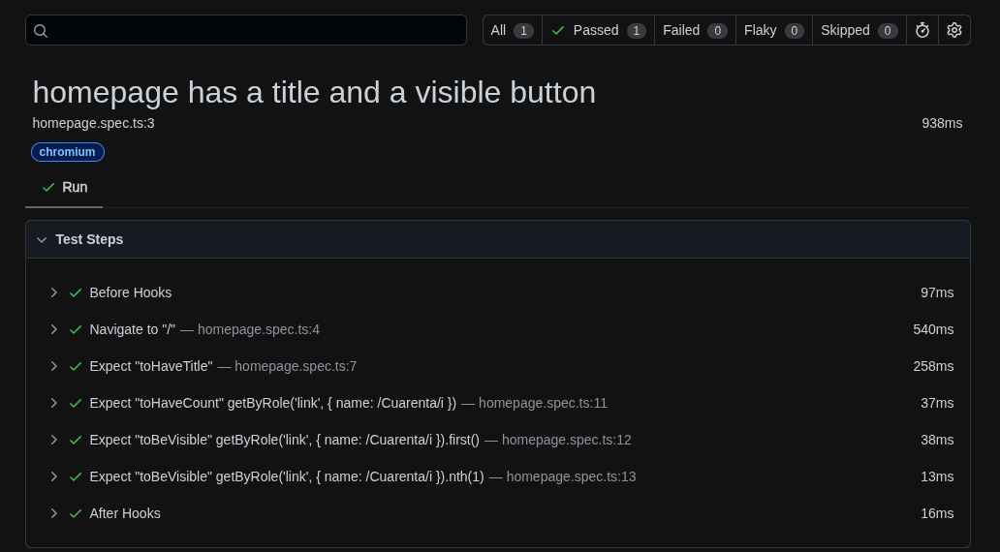

# 📌 PARTE 2: Integración de Técnicas Avanzadas

**Valor: 10 puntos**

## 🔹 Sección 1: Orquestación de Pruebas Combinatorias (5 pts)

El sistema bajo prueba, implementado en el notebook `Shop_agent.ipynb`, consiste en una arquitectura multi-agente diseñada para un e-commerce. Utiliza el **Google Agent Development Kit (ADK)** para orquestar la interacción entre agentes y herramientas externas. 

puedes acceder a ver el colab desde [Colab-Fait-arch](https://colab.research.google.com/drive/1o1Yk2Yk3bX4Jt5v5Zz5Zz5Zz5Zz5Zz5#scrollTo=example).

Desarrollar un sistema que:

#### Arquitectura Técnica del Sistema de Agentes
1.  **`research_agent` (Agente Investigador):**
    *   **Modelo:** `gemini-2.5-flash`.
    *   **Función:** Su rol es actuar como un investigador de mercado. Recibe una consulta general del usuario (p. ej., "regalo para un niño de 10 años") y la enriquece.
    *   **Herramientas:** Utiliza la herramienta `google_search` integrada en el ADK para investigar tendencias y productos populares relacionados con la consulta.
    *   **Salida:** Genera una lista de 5 consultas de búsqueda más específicas y optimizadas (p. ej., "Kits de robótica para niños de 10 años", "Juegos de construcción avanzados").

2.  **`shop_agent` (Agente de Compras):**
    *   **Modelo:** `gemini-2.5-flash`.
    *   **Función:** Es el agente principal que interactúa con el usuario y orquesta el proceso completo de recomendación.
    *   **Herramientas:**
        *   **`AgentTool(research_agent)`:** Invoca al `research_agent` como una herramienta para obtener las consultas de búsqueda específicas.
        *   **`find_shopping_items`:** Una función personalizada que recibe la lista de consultas del `research_agent`. Itera sobre ellas y llama a la función `call_vector_search` para cada una.

3.  **`call_vector_search` (Función de Búsqueda Vectorial):**
    *   **Tecnología:** Realiza una solicitud `HTTP POST` a un endpoint de API REST (`https://www.ac0.cloudadvocacyorg.joonix.net/api/query`).
    *   **Lógica:** Envía la consulta junto con parámetros para una búsqueda híbrida, combinando búsqueda semántica (densa) y por palabras clave (dispersa) para mejorar la relevancia de los resultados. Utiliza un reranker para refinar la selección final.

**Flujo de Ejecución:**

El proceso completo, desde la consulta del usuario hasta la respuesta final, sigue estos pasos:

1.  El usuario envía una consulta al `shop_agent` (p. ej., "¿Puedes encontrar un regalo de cumpleaños para un hijo de 10 años?").
2.  El `shop_agent`, siguiendo sus instrucciones, invoca a su herramienta `research_agent` con la consulta del usuario.
3.  El `research_agent` utiliza `google_search` para investigar ideas de regalos populares para esa demografía.
4.  Basado en la investigación, el `research_agent` genera y devuelve una lista de 5 consultas de búsqueda detalladas.
5.  El `shop_agent` recibe esta lista y la pasa a su herramienta `find_shopping_items`.
6.  La herramienta `find_shopping_items` ejecuta la función `call_vector_search` para cada una de las 5 consultas, recopilando los artículos encontrados en el backend de búsqueda vectorial.
7.  Los artículos encontrados se devuelven al `shop_agent`.
8.  Finalmente, el `shop_agent` procesa la lista de artículos y presenta al usuario una respuesta formateada que incluye el nombre, la descripción y la URL de la imagen de cada producto recomendado.

### Genere casos de prueba combinatorios automáticamente.
Desarrollar una función conceptual para asignar un "nivel de riesgo" a cada caso de prueba. "assign_risk_score" asigna un puntaje de riesgo a cada consulta según la coherencia entre edad y tipo de usuario, presencia de palabras clave sensibles y complejidad del texto, para priorizar casos de prueba críticos.


### Priorice los casos según nivel de riesgo.
Función assign_risk_score asigna nivel de riesgo según coherencia edad/tipo de usuario, palabras clave sensibles y complejidad. Prioriza casos críticos: primero combinaciones inusuales, luego palabras sensibles, después complejidad, y finalmente casos estándar. Esto asegura que los escenarios con mayor probabilidad de fallo se prueben primero.

Los parámetros (edad, género, ocasión) determinan el riesgo. Bajo riesgo: combinaciones estándar coherentes (niño 8 años en cumpleaños). Medio riesgo: contienen palabras sensibles (aniversario, sensible). Alto riesgo: combinaciones inusuales (adulto 8 años) o sensibles con edades inesperadas. Estos casos deben ejecutarse primero.

### Aprenda de ejecuciones previas mediante modelos de predicción.
Implementa bucle que itere sobre casos priorizados, llame a `test_agent`, imprima resultados Y APRENDA de ejecuciones previas usando modelos de predicción.

---

## 🔹 Sección 2: Pipeline de Testing Integral (5 pts)

Diseñar e implementar un pipeline que integre:

###  Análisis estático (p. ej., **SonarQube**).
ejecutamos el comando para hacer los test de SonarQube:

```bash
# Configurar variables de entorno
export SONAR_HOST_URL="http://localhost:9000"
export SONAR_TOKEN="sqa_8a9660b181d14ebbe4ce222ad4ef95794f202c63"

# Ejecutar análisis
npx sonarqube-scanner \
    -Dsonar.projectKey=nextjs-project \
    -Dsonar.sources=. \
    -Dsonar.host.url=$SONAR_HOST_URL \
    -Dsonar.login=$SONAR_TOKEN
```
---




**Lo Bueno:**
SECURITY (Seguridad): A
- 0 vulnerabilidades confirmadas
- Esto es EXCELENTE, significa que no tienes vulnerabilidades críticas

MAINTAINABILITY (Mantenibilidad): A
- 67 issues pero son de baja severidad (code smells)
- Tu código es relativamente fácil de mantener

DUPLICATIONS (Duplicaciones): 2.9%
- Solo 2.9% de código duplicado - ¡MUY BUENO!
- Esto indica buen diseño


### Análisis dinámico con herramientas de prueba (p. ej., **Jest**, **Cypress**).


**Análisis del resultado del test:** 
Se ejecutaron exitosamente tres pruebas unitarias para el componente Button, confirmando que: (1) el botón se renderiza correctamente con su texto, (2) responde a eventos click ejecutando la función callback correspondiente, y (3) aplica correctamente el estado "disabled" cuando recibe dicha propiedad. Sin embargo, el reporte de cobertura revela una situación crítica: aunque Button.tsx alcanza el 100% de cobertura, el análisis global muestra una cobertura mínima (0.47%) porque Jest está evaluando todos los archivos del proyecto (1,263 líneas de código) sin encontrar pruebas para los demás componentes. Esto evidencia que, mientras el sistema de pruebas funciona correctamente para componentes individuales, la mayoría del código base carece de testeo automatizado, generando alertas por incumplimiento de los umbrales mínimos de cobertura establecidos (80%).


### Pruebas combinatorias (ACTS).


Se ejecutaron pruebas combinatorias exhaustivas del componente Button utilizando ACTS para generar casos de prueba óptimos, cubriendo todas las combinaciones relevantes de propiedades:

```
✓ debe renderizar correctamente con variant=primary, size=small, y disabled=true (51 ms)
✓ debe renderizar correctamente con variant=primary, size=medium, y disabled=false (6 ms)
✓ debe renderizar correctamente con variant=primary, size=large, y disabled=true (5 ms)
✓ debe renderizar correctamente con variant=secondary, size=small, y disabled=false (4 ms)
✓ debe renderizar correctamente con variant=secondary, size=medium, y disabled=true (4 ms)
✓ debe renderizar correctamente con variant=secondary, size=large, y disabled=false (4 ms)
✓ debe renderizar correctamente con variant=danger, size=small, y disabled=true (3 ms)
✓ debe renderizar correctamente con variant=danger, size=medium, y disabled=false (3 ms)
✓ debe renderizar correctamente con variant=danger, size=large, y disabled=true (3 ms)
```
Todos los casos pasaron exitosamente, validando que el componente maneja correctamente todas las combinaciones de variantes (primary, secondary, danger), tamaños (small, medium, large) y estados de deshabilitación.

### Automatización *codeless* (playwright).
En ves de usar "TestCraft" opte por usar playwright, ya que es una herramienta mas robusta y flexible para automatizar pruebas de aplicaciones web comparibles directamnte con nextj







### Modelo predictivo de confiabilidad (SMERFS, Frestimate).
