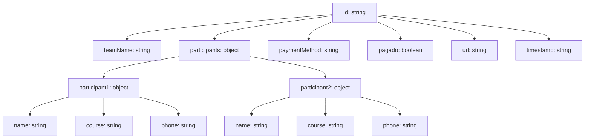

# Documentación del Módulo `src/modules/cuarenta`

Este documento explica la estructura y el propósito del sistema de registro de parejas para el juego "Cuarenta", basado en el formato JSON proporcionado.

## Estructura del JSON de Registro de Pareja

Tabla:



El JSON:

```json
{
	"id": "pareja_001",
	"teamName": "Los Campeones",
	"participants": {
		"participant1": {
			"name": "Juan Pérez",
			"course": "Ingeniería en Software",
			"phone": "0991234567"
		},
		"participant2": {
			"name": "María López",
			"course": "Ciencias de Datos",
			"phone": "0987654321"
		}
	},
	"paymentMethod": "Transferencia",
	"pagado": false,
	"url": "https://tusitio.com/registro/pareja_001",
	"timestamp": "2025-11-25T18:42:53.123Z"
}
```

### Descripción de los Campos:

- **`id` (string):** Identificador único de la pareja. Se recomienda un formato que combine un prefijo (ej. `pareja_`) con un número secuencial o un UUID para asegurar unicidad.
- **`teamName` (string):** Nombre con el que la pareja se registrará y será conocida en el torneo.
- **`participants` (object):** Un objeto que contiene la información detallada de cada miembro de la pareja.
  - **`participant1` (object):** Información del primer participante.
    - **`name` (string):** Nombre completo del participante.
    - **`course` (string):** Carrera o curso que estudia el participante (útil para segmentación o estadísticas).
    - **`phone` (string):** Número de teléfono de contacto del participante.
  - **`participant2` (object):** Información del segundo participante, con la misma estructura que `participant1`.
- **`paymentMethod` (string):** Indica el método de pago elegido por la pareja (ej. "Transferencia", "Efectivo", "Tarjeta").
- **`pagado` (boolean):** Un indicador booleano que especifica si la pareja ya ha completado el pago de su inscripción (`true`) o si aún está pendiente (`false`).
- **`url` (string):** Una URL que podría ser utilizada para acceder a los detalles del registro de esta pareja, o un enlace de confirmación/pago específico para ellos.
- **`timestamp` (string):** Marca de tiempo en formato ISO 8601 que indica la fecha y hora exacta en que se realizó el registro.

## Flujo de Funcionamiento (Hipótesis)

El módulo `src/modules/cuarenta` probablemente gestiona el ciclo de vida de estos registros de pareja. Un flujo típico podría ser:

1.  **Registro Inicial:** Un usuario (o un sistema) envía los datos de una nueva pareja (excluyendo `id`, `pagado`, `url`, `timestamp` que serían generados por el sistema) al módulo.
2.  **Generación de Datos:** El módulo genera un `id` único, establece `pagado` en `false` por defecto, genera una `url` específica para la pareja (si aplica) y registra el `timestamp` del momento del registro.
3.  **Almacenamiento:** La información completa de la pareja se almacena en una base de datos o un sistema de persistencia.
4.  **Confirmación/Notificación:** Se podría enviar una confirmación a los participantes, posiblemente incluyendo la `url` para que puedan revisar su registro o completar el pago.
5.  **Actualización de Pago:** Cuando la pareja realiza el pago, el módulo recibe una notificación (ej. desde un sistema de pagos) y actualiza el campo `pagado` a `true` para el `id` de la pareja correspondiente.
6.  **Consulta:** El módulo permite consultar los registros de parejas, ya sea por `id`, `teamName`, estado de `pagado`, etc.
